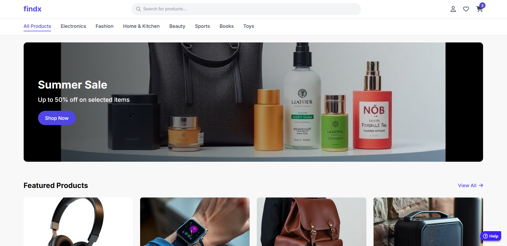

# 🛍️ FindX BuyFlow Application

A scalable, modular, and modern E-Commerce platform built using Micro-Frontends and Microservices architecture, supporting both web and mobile shopping experiences.

## ✨ Tech Stack

### Frontend
- **React.js** – Customer-facing storefront
- **Angular** – Admin dashboard and management modules
- **Micro-Frontends** – Independently deployable UI modules
- **React Native** – Mobile app for iOS & Android

### Backend
- **Spring Boot** – Core Java-based microservices
- **Node.js** – Lightweight JavaScript microservices
- **Eureka Server** – Service registry and discovery
- **WebSocket** – Real-time communication (live orders, chat, etc.)

### Authentication & Security
- **Google OAuth** – Simple, secure login
- **Keycloak** – Identity and access management

### Integrations & Features
- **Payment Gateway** – Secure payment transactions
- **AWS S3** – Cloud file and image storage
- **MySQL & MongoDB** – Dual database support for structured and unstructured data
- **Real-time Features** – Instant notifications and updates via WebSocket

---

## 📱 Mobile App – FindX On-the-Go  🔗 [Link here](https://github.com/SamithaSenewiratna/FindX-moblie-app-ReactNative)

Fully integrated mobile shopping experience built with **React Native**:
- Product browsing and purchasing
- Secure login and user management
- Real-time order tracking
- Push notifications

---

## 📌 Key Features

- 🧩 Modular micro-frontend architecture
- ⚙️ Distributed microservices backend
- 🔐 Secure OAuth and Keycloak-based authentication
- 💬 Real-time updates using WebSocket
- 💳 Integrated payment processing
- ☁️ Cloud file uploads via AWS S3
- 🧵 Relational (MySQL) and NoSQL (MongoDB) database support
- 📱 React Native mobile application

---

## 📷 Screenshots

---

